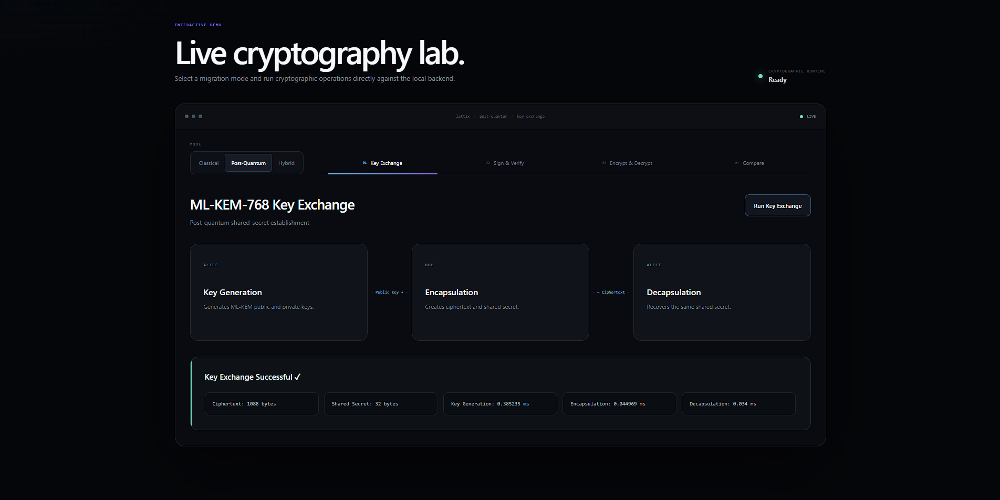
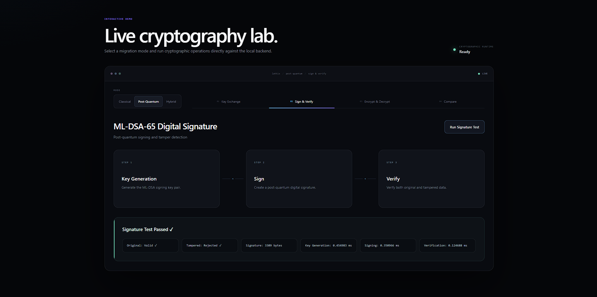
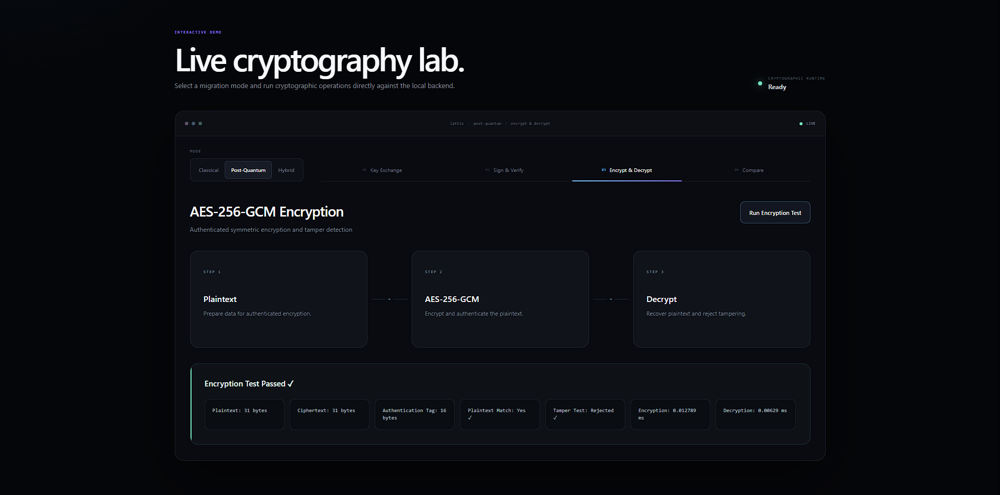
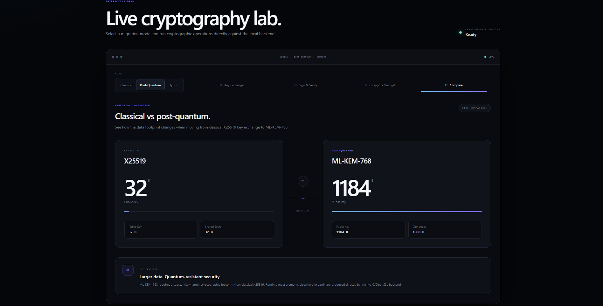
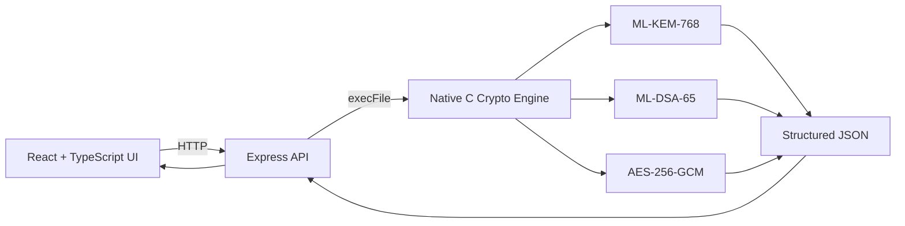

# Lattix

**An interactive post-quantum cryptography migration lab backed by native C execution.**

Lattix makes post-quantum migration tangible by running ML-KEM-768 key establishment, ML-DSA-65 digital signatures, and AES-256-GCM authenticated encryption through a native C/OpenSSL backend.

Instead of displaying predetermined demo values, the application executes cryptographic operations locally and returns live measurements, validation results, and tamper-detection outcomes to the TypeScript interface.

---

## Why Lattix?

Post-quantum migration is not simply a matter of replacing one algorithm with another.

New cryptographic standards introduce different key sizes, ciphertext sizes, execution characteristics, and integration requirements. Lattix was built to make several of those differences visible through an interactive application rather than static examples.

The project turns migration concepts into executable workflows:

**key establishment → digital signatures → authenticated encryption → measurement**

Each supported operation runs through the native cryptographic backend and returns structured results to the interface.

---

## Live Cryptography Lab

Lattix currently exposes four interactive views.

### ML-KEM-768 Key Establishment

The key-exchange workflow visualizes three stages:

**key generation → encapsulation → decapsulation**

The backend returns:

- ciphertext size
- shared-secret size
- key-generation time
- encapsulation time
- decapsulation time

A successful run confirms that the key-establishment operation completed and exposes the resulting measurements directly in the interface.



### ML-DSA-65 Digital Signatures

The signature workflow demonstrates both successful verification and tamper detection.

Lattix:

1. generates the signing material
2. produces an ML-DSA-65 signature
3. verifies the original data
4. verifies modified data separately
5. confirms that the tampered input is rejected

The interface also reports signature size and runtime measurements for key generation, signing, and verification.



### AES-256-GCM Authenticated Encryption

The encryption workflow demonstrates authenticated symmetric encryption.

The backend:

- encrypts plaintext with AES-256-GCM
- decrypts the ciphertext
- verifies that the recovered plaintext matches
- generates an authentication tag
- modifies protected data as a tamper test
- confirms that tampered data is rejected

Encryption and decryption timing measurements are returned with each execution.



### Classical vs Post-Quantum

Lattix also includes a focused migration comparison between classical X25519 and ML-KEM-768.

| Algorithm | Public Key | Exchange Data |
| --- | ---: | ---: |
| X25519 | 32 B | 32 B shared secret |
| ML-KEM-768 | 1184 B | 1088 B ciphertext |

The comparison illustrates one practical migration tradeoff: post-quantum key establishment can require a substantially larger cryptographic data footprint than classical alternatives.



---

## Architecture



Lattix is split into three layers:

**Frontend**  
React and TypeScript provide the interactive visualization, operation controls, loading states, result presentation, comparison interface, and error handling.

**API bridge**  
A lightweight Node.js/Express service accepts HTTP requests from the frontend and launches the requested native cryptographic operation.

**Cryptographic engine**  
The C backend performs the actual cryptographic work using OpenSSL, records operation measurements, and emits structured JSON for the API layer.

This separation keeps the UI independent from the native implementation while still allowing the browser application to display results from real C execution.

---

## Native Cryptographic Backend

The native backend exposes three executable operations:

```text
ml-kem
ml-dsa
aes
```

For example:

```cmd
lattix.exe ml-kem
```

returns structured output similar to:

```json
{
  "success": true,
  "algorithm": "ML-KEM-768",
  "ciphertext_size": 1088,
  "shared_secret_size": 32,
  "keygen_ms": 2.5485,
  "encapsulation_ms": 0.0864,
  "decapsulation_ms": 0.0952
}
```

The exact timing values vary between systems and executions because they are measured from live operations rather than stored demo values.

The API layer runs the binary with Node's `execFile()` and forwards the parsed response to the frontend.

---

## API

The local API runs on:

```text
http://localhost:3001
```

Available endpoints:

```http
GET /api/ml-kem
GET /api/ml-dsa
GET /api/aes
```

The root endpoint also exposes runtime status information:

```http
GET /
```

Example:

```json
{
  "success": true,
  "service": "Lattix API",
  "runtime": "C / OpenSSL",
  "backendReady": true
}
```

The API validates requested operations, checks that the compiled native backend exists, handles execution failures, and rejects invalid backend output rather than forwarding malformed data to the frontend.

---

## Tech Stack

### Frontend

- React
- TypeScript
- Vite
- CSS

### API Layer

- Node.js
- Express
- CORS

### Native Backend

- C
- OpenSSL
- CMake
- Visual Studio C/C++ toolchain

### Cryptography

- ML-KEM-768
- ML-DSA-65
- AES-256-GCM
- X25519 migration comparison

---

## Project Structure

```text
lattix/
│
├── frontend/
│   ├── public/
│   │
│   ├── src/
│   │   ├── components/
│   │   │   ├── BenchmarkDashboard.tsx
│   │   │   ├── EncryptionDemo.tsx
│   │   │   ├── ErrorMessage.tsx
│   │   │   ├── KeyExchange.tsx
│   │   │   └── SignatureDemo.tsx
│   │   │
│   │   ├── pages/
│   │   │   └── Dashboard.tsx
│   │   │
│   │   ├── services/
│   │   │   └── api.ts
│   │   │
│   │   └── types/
│   │       └── crypto.ts
│   │
│   ├── .env.example
│   ├── package.json
│   └── vite.config.ts
│
├── backend/
│   │
│   ├── api/
│   │   ├── server.mjs
│   │   ├── package.json
│   │   └── package-lock.json
│   │
│   └── c/
│       ├── include/
│       │   ├── api.h
│       │   ├── crypto_aes.h
│       │   ├── crypto_kem.h
│       │   ├── crypto_signature.h
│       │   └── platform_compat.h
│       │
│       ├── src/
│       │   ├── api.c
│       │   ├── crypto_aes.c
│       │   ├── crypto_kem.c
│       │   ├── crypto_signature.c
│       │   └── main.c
│       │
│       └── CMakeLists.txt
│
├── docs/
│   └── screenshots/
│
├── .gitignore
└── README.md
```

---

## Local Development

### Prerequisites

The current Windows development setup uses:

- Node.js
- npm
- CMake
- Visual Studio 2022 Build Tools
- Desktop development with C++
- OpenSSL

Lattix has been tested using the Visual Studio 2022 x64 toolchain on Windows.

---

### 1. Clone the Repository

```powershell
git clone https://github.com/Elias-Kampey/lattix.git
cd lattix
```

---

### 2. Build the Native Backend

Open **x64 Native Tools Command Prompt for VS 2022**.

Navigate to the C backend:

```cmd
cd backend\c
```

Configure the project:

```cmd
cmake -S . -B build -G "Visual Studio 17 2022" -A x64 -DOPENSSL_ROOT_DIR="C:\Program Files\OpenSSL-Win64"
```

Build:

```cmd
cmake --build build --config Debug
```

The executable should be generated at:

```text
backend/c/build/Debug/lattix.exe
```

Test ML-KEM directly:

```cmd
build\Debug\lattix.exe ml-kem
```

A successful execution should return JSON containing:

```json
{
  "success": true,
  "algorithm": "ML-KEM-768"
}
```

---

### 3. Start the API

Open a new terminal from the repository root:

```powershell
cd backend\api
npm install
npm start
```

The API should report:

```text
Lattix API running at http://localhost:3001
C backend: ready
```

You can verify it directly at:

```text
http://localhost:3001/api/ml-kem
```

---

### 4. Configure the Frontend

Inside `frontend/`, create a local `.env` file:

```env
VITE_API_URL=http://localhost:3001
```

The repository includes `.env.example` as a template.

The real `.env` file is ignored by Git.

---

### 5. Start the Frontend

Open another terminal:

```powershell
cd frontend
npm install
npm run dev
```

Then open:

```text
http://localhost:5173
```

The complete local runtime is:

```text
React / TypeScript
localhost:5173
        │
        │ HTTP
        ▼
Node / Express API
localhost:3001
        │
        │ execFile()
        ▼
C / OpenSSL
lattix.exe
```

---

## Testing

Lattix was manually tested across the complete frontend-to-native execution path.

### ML-KEM-768

Verified:

- successful native execution
- ciphertext size returned
- shared-secret size returned
- key-generation measurement returned
- encapsulation measurement returned
- decapsulation measurement returned

### ML-DSA-65

Verified:

- signing operation succeeds
- original data verifies successfully
- modified data is rejected
- signature size is returned
- key-generation, signing, and verification measurements are returned

### AES-256-GCM

Verified:

- encryption succeeds
- decryption succeeds
- recovered plaintext matches
- authentication tag is generated
- modified protected data is rejected
- encryption and decryption measurements are returned

### Integration

Verified:

- C backend execution
- structured JSON output
- Express API communication
- frontend API consumption
- loading states
- successful result states
- backend-offline error state
- production frontend build
- operation navigation
- migration comparison layout

---

## Current Scope

Lattix currently executes cryptographic workflows through **Post-Quantum mode**.

The Classical and Hybrid selectors are present as migration contexts in the interface, but their executable workflows are outside the current project scope.

The comparison view uses X25519 data to illustrate the difference in cryptographic footprint between classical and post-quantum key establishment.

Lattix is an educational and portfolio project and is not intended to be used as production cryptographic infrastructure.

---

## What I Learned

Building Lattix reinforced that integrating native cryptographic code into an interactive application introduces challenges well beyond implementing the algorithms themselves.

Some of the most useful engineering questions were:

- How should native C results be represented across an HTTP boundary?
- How can one API contract support several cryptographic operations?
- How should timing data be measured consistently across platforms?
- How should Linux-oriented C code be adapted for Windows development?
- How should the application respond when the native backend is unavailable?
- How can abstract cryptographic workflows be made understandable without oversimplifying them?
- Which post-quantum migration differences are most useful to expose visually?

The project also provided hands-on experience connecting three distinct layers — a TypeScript frontend, Node API, and native C runtime — into one working system.

---

## Contributors

### Elias Mahdi

Frontend, application integration, and product interface.

- designed and developed the React/TypeScript interface
- built the interactive ML-KEM, ML-DSA, AES-GCM, and migration-comparison views
- implemented frontend API integration and TypeScript response models
- added loading, success, and backend-failure states
- integrated the frontend with the native cryptographic runtime
- redesigned the final application interface
- reorganized the repository into separate frontend, API, and native backend layers
- performed end-to-end integration and UI testing

### MK

Native cryptographic backend.

- developed the C cryptographic engine
- implemented ML-KEM-768 operations
- implemented ML-DSA-65 signing and verification
- implemented AES-256-GCM authenticated encryption
- added tamper-detection tests
- added cryptographic measurements
- exposed structured backend results for application integration

---

## Repository

**GitHub:**  
https://github.com/Elias-Kampey/lattix
